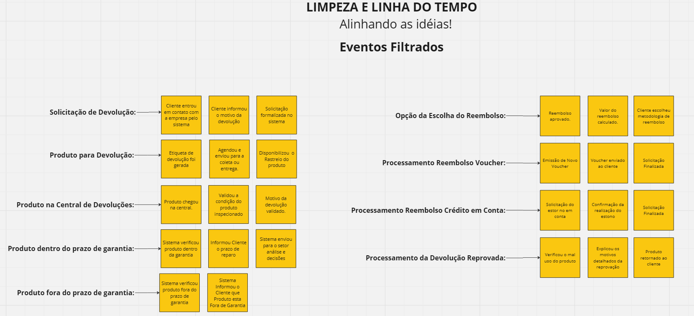
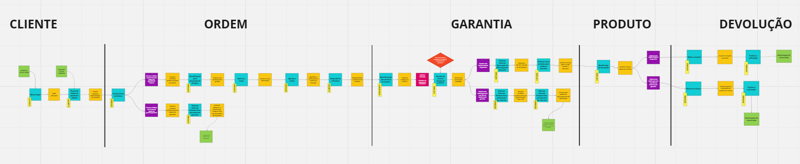
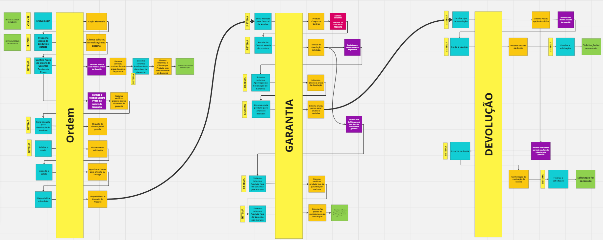

<div align="center">
<a href="https://www.fiap.com.br" target="_blank">
    
</a>

[](https://docs.oracle.com/en/java/javase/11)
[](https://docs.spring.io/spring-boot/docs/current/reference/htmlsingle)
</div>

# TRABALHO DE CONCLUSÃO - FASE 1 - PRIMEIROS PASSOS COM SPRING

## A) Software

Para executar o projeto , siga os passos abaixo:
1.  **Download do projeto no GitHub:**  Primeiro, faça o download do projeto a partir do repositório no GitHub. Você pode clonar o repositório usando o seguinte comando:

    ```shell
    $ git clone https://github.com/marcello222/reversLog.git
    ```
4.  **Pré-requisitos:**  Antes de executar o projeto, certifique-se de ter instalado os seguintes componentes:
    ```shell  
    -   Maven (versão 3.x)
    -   Java 11
    -   PostgreSQL (versão 16.x)
     ```
5.  **No diretório do projeto:**  Navegue até o diretório onde você clonou o projeto:
    ```shell
    cd reversLog
    ```
6.  **Compilando e empacotando com o Maven:**  Execute o seguinte comando para compilar o projeto e gerar o arquivo JAR:
    ```shell
    mvn clean package
    ```
8.  **Executando a aplicação:**  Agora, inicie a aplicação com o seguinte comando:
    ```shell
    java -jar target/reversLog-1.0-SNAPSHOT.jar
    ```
## B) Documentação

### 1. Resumo

**1.1. História**

O Sistema de Gerenciamento de Devoluções foi desenvolvido para atender à necessidade de automatizar o processo de devolução de produtos em uma empresa de varejo. O sistema anterior era manual e ineficiente, o que causava atrasos no processamento das devoluções e insatisfação dos clientes.

**1.2. Motivação**

O principal fator que motivou o desenvolvimento do Sistema de Gerenciamento de Devoluções foi a necessidade de:

-   **Aumentar a eficiência do processo de devolução de produtos:** O sistema manual era lento e sujeito a erros, o que causava atrasos no processamento das devoluções e insatisfação dos clientes. O novo sistema automatiza o processo, o que permite que as devoluções sejam processadas mais rapidamente e com mais precisão.
-   **Melhorar a experiência do cliente:** O novo sistema oferece aos clientes uma maneira rápida e fácil de solicitar a devolução de produtos. O sistema também fornece aos clientes informações sobre o status de suas devoluções, o que ajuda a reduzir a frustração.
-   **Reduzir custos:** O sistema automatizado ajuda a reduzir custos ao eliminar a necessidade de trabalho manual. O sistema também ajuda a reduzir custos ao prevenir fraudes e erros.

**1.3. Justificativa**

O Sistema de Gerenciamento de Devoluções oferece vários benefícios para a empresa, incluindo:

-   **Maior eficiência:** O sistema automatiza o processo de devolução de produtos, o que permite que as devoluções sejam processadas mais rapidamente e com mais precisão.
-   **Melhor experiência do cliente:** O sistema oferece aos clientes uma maneira rápida e fácil de solicitar a devolução de produtos. O sistema também fornece aos clientes informações sobre o status de suas devoluções, o que ajuda a reduzir a frustração.
-   **Menores custos:** O sistema automatizado ajuda a reduzir custos ao eliminar a necessidade de trabalho manual. O sistema também ajuda a reduzir custos ao prevenir fraudes e erros.

**1.4. Arquitetura Proposta**

A arquitetura DDD proposta para o Sistema de Gerenciamento de Devoluções é composta pelos seguintes componentes:

-   **Agregação de produtos:** Este agregado é responsável por gerenciar informações sobre produtos, incluindo nome, descrição, preço e estoque.
-   **Agregação de pedidos:** Este agregado é responsável por gerenciar informações sobre pedidos, incluindo data do pedido, valor do pedido e itens do pedido.
-   **Agregação de devoluções:** Este agregado é responsável por gerenciar informações sobre devoluções, incluindo data da devolução, motivo da devolução e itens da devolução.

<p align="center">
  
</p>


- **1.5. Domínio e Subdomínio**

O domínio principal do Sistema de Gerenciamento de Devoluções é o **domínio de gerenciamento de devoluções**. Este domínio é responsável por gerenciar o processo de devolução de produtos.

O domínio de gerenciamento de devoluções é composto pelos seguintes subdomínios:

-   **Subdomínio de produtos:** Este subdomínio é responsável por gerenciar informações sobre produtos.

-   **Subdomínio de pedidos:** Este subdomínio é responsável por gerenciar informações sobre pedidos.

-   **Subdomínio de devoluções:** Este subdomínio é responsável por gerenciar informações sobre devoluções.

**1.6. Eventos**

-   **Cliente solicita devolução:** Este evento é disparado quando um cliente solicita a devolução de um produto.

-   **Produto é recebido:** Este evento é disparado quando o produto devolvido é recebibo.

-   **Aprovação/Rejeição da devolução:** Disparado após a análise do motivo da devolução e condição do produto.

-   **Reembolso emitido:** Disparado após a aprovação da devolução e processamento do reembolso para o cliente.


### 2. Comandos

-   **Comando "Solicitar Devolução":** Enviado pelo cliente através do sistema para iniciar o processo de devolução.
-   **Comando "Registrar Recebimento":** Registrado pelo funcionário do armazém após o recebimento do produto devolvido.
-   **Comando "Aprovar Devolução":** Enviado por um funcionário autorizado após a análise do motivo e condição do produto.
-   **Comando "Reembolsar Cliente":** Enviado para o sistema financeiro para processar o reembolso do cliente após a aprovação da devolução.

###  3. Agregados

-   **Pedido:** O agregado Pedido pode gerenciar o histórico e informações do pedido associado à devolução.
-   **Produto:** O agregado Produto pode gerenciar informações do produto devolvido, incluindo quantidade e detalhes do item.
-   **Devolução:** O agregado Devolução pode ser o principal responsável por gerenciar o processo de devolução, incluindo o motivo, status, itens devolvidos e histórico de eventos relacionados.

###  4. Fluxo do Processo

1.  **Cliente solicita devolução:** Cliente envia o comando "Solicitar Devolução" através do sistema.

2.  **Pedido/Produto atualizado:** O sistema atualiza o status do pedido associado e/ou registra a devolução no agregado Produto (dependendo da implementação).

3.  **Produto é enviado:** Cliente envia o produto para o armazém.

4.  **Produto é recebido:** Funcionário do armazém registra o recebimento do produto com o comando "Registrar Recebimento".

5.  **Devolução criada/atualizada:** O sistema cria ou atualiza o agregado Devolução com base nas informações do produto recebido.

6.  **Análise da devolução:** Funcionário autorizado analisa o motivo da devolução e condição do produto.

7.  **Aprovação/Rejeição da devolução:**

    -   **Aprovação:** Comando "Aprovar Devolução" é enviado para registrar a aprovação.
    -   **Rejeição:** Sistema registra a rejeição e notifica o cliente.
8.  **Reembolso processado (se aplicável):** Comando "Reembolsar Cliente" é enviado para processar o reembolso.


###  5. Event Storming

-   O Event Storming foi elaborado utilizando a ferramenta online **MIRO**
[![LINK]](https://miro.com/app/board/uXjVKTlAnh4=/)

<p align="center">
  
  
  
  
  
  
</p>

###  6. Backlog

Durante o desenvolvimento de um projeto, é comum encontrar tarefas que ainda não foram concluídas, seja por questões de prioridade ou por exigirem mais tempo e esforço. Para organizar e priorizar essas pendências, criamos o backlog. Abaixo estão algumas das tarefas planejadas para serem desenvolvidas no futuro:

-   Criação dos Map Struct para mapear objetos de DTO para Entity, e vice-versa
-   Criação da camara de Seriço de toda implementação de regra de negócio, utilizando alguns Design Parterns como Strategy, entre outros
-   Criação de Interface de Serviço
-   Criação de Interface de Controller
-   Definir e Viabilizar como será o recebimento do retorno da central de análise de produto

## C) Participantes

-   RM353873 - Kleuber Costa
-   RM354111 - Felipe Oliveira
-   RM354482 - Letícia Oliveira
-   RM354525 - Marcello Caseiro
-   RM355621 - Paulo Bof
